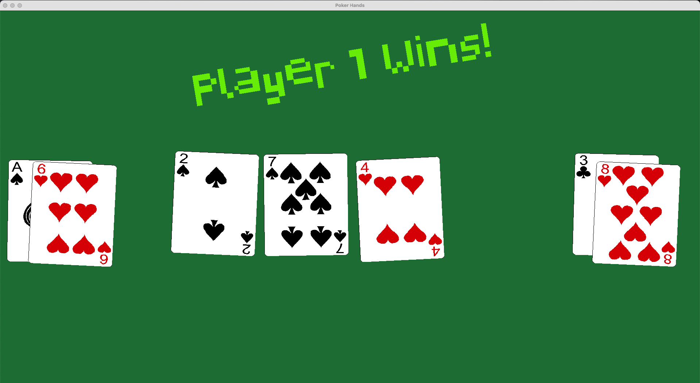
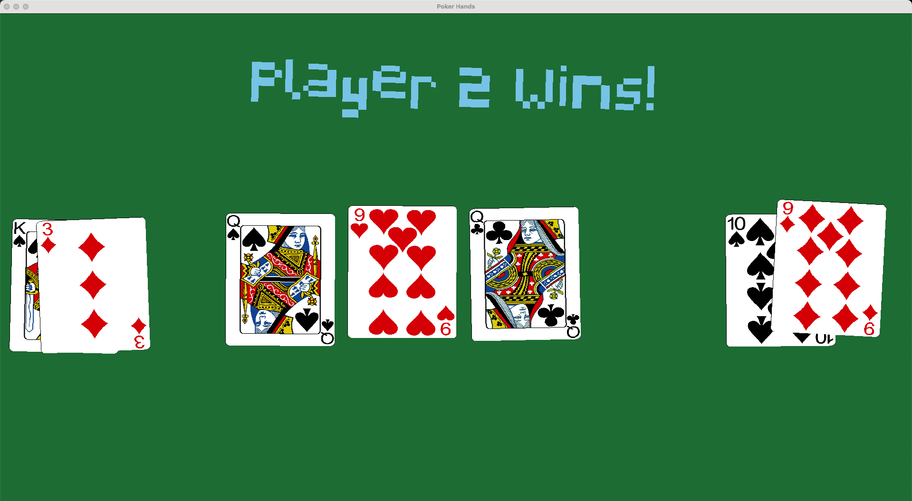

# Poker Game

## Overview

The Poker Game project is an interactive graphical implementation of a poker game built using Python and Pygame. This project allows players to engage in a digital poker experience. The game features a user-friendly interface, animated card movements, and realistic card mechanics, making it an enjoyable experience for poker enthusiasts.

<table style="border-collapse: separate; border-spacing: 20px;">
    <tr>
        <td></td>
        <td></td>
    </tr>
</table>

In this poker game, Player 1 and Player 2 each receive 2 cards, while three community cards are dealt on the table. In contrast to traditional Texas Hold'em poker, where the dealer places five community cards on the table, this variation features only three cards, resulting in reduced odds of forming a strong hand. The player with the better hand wins the game, and you can immediately play another round with a simple click anywhere on the screen.

## Features

- **Graphical User Interface (GUI)**: The game is developed with a visually appealing GUI, designed to provide a seamless and immersive experience. Players can easily view their cards, the community cards, and the betting options.
- **Dynamic Card Animation**: Cards are animated when dealt, providing a smooth transition and enhancing the game's visual appeal. The cards can rotate and scale to create an engaging user experience.
- **Game Logic**: The underlying game logic handles the rules of poker, including dealing cards, evaluating hands, and determining the winner, ensuring a fair and competitive environment.

## Tools and Technologies

This project leverages several Python libraries and frameworks, including:

- **Pygame**: The core library used for creating the game’s graphics, handling user input, and managing the game loop. Pygame provides essential functionalities like drawing shapes, loading images, and handling events, which are crucial for game development.
- **Python**: The primary programming language used to develop the game, chosen for its simplicity and readability, which facilitates rapid development and debugging.
- **Random**: A built-in Python library used to introduce randomness in card dealing and animations, ensuring a unique experience for each game session.

## Installation and Usage

To run the game, ensure you have Python and Pygame installed on your system. Clone this repository and navigate to the project directory:

```bash
git clone https://github.com/matejpopovski/poker-game.git
cd Poker-Game

```

🔊 Soon to be added: Card Sounds, Tip The Dealer, Poker Odds Calculator

